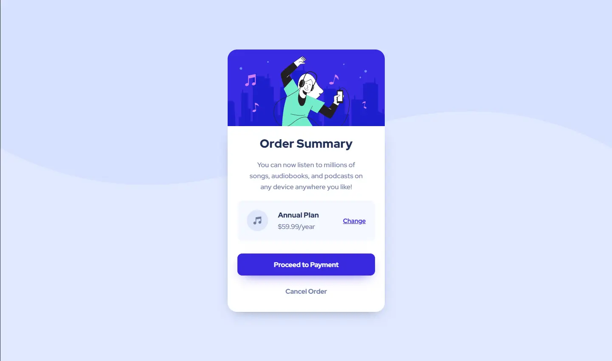
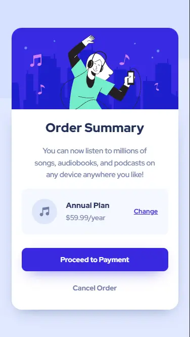

# Frontend Mentor - Order summary card solution

This is my solution to the [Order summary card challenge on Frontend Mentor](https://www.frontendmentor.io/challenges/order-summary-component-QlPmajDUj).

## Table of contents

- [Overview](#overview)
  - [The challenge](#the-challenge)
  - [Screenshot](#screenshot)
  - [Links](#links)
- [My process](#my-process)
  - [Built with](#built-with)
  - [What I learned](#what-i-learned)
  - [Continued development](#continued-development)
- [Author](#author)

## Overview

I have not done anything with React for a long time, I decided to start building a design of a component to update the field a bit.

I really enjoyed this little job, it was super fast and it helped me realize that I still don't really like React's learning curve... so I'll leave it here and try my best to learn Vue Js first.

### The challenge

Users should be able to:

- See hover states for interactive elements

### Screenshot

### Links

- Solution URL: [Frontend Mentor Solution](https://your-solution-url.com)
- Live Site URL: [Order Summary Card](https://arr-order-summary-card.vercel.app/)

## My process

For this solution I used SASS to style the component. I am very happy cus I was able to get a little more familiar with some of the preprocessor features to better distribute the use of my styles in the project.

### Built with

- Semantic HTML5 markup
- SCSS custom properties
- Flexible box
- First mobile workflow
- [SASS](https://sass-lang.com/) - To compile CSS
- [AOS Animation](https://styled-components.com/) - For animation of scrolling sections

### What I learned
I think the best part of this project was learning a better use of SASS features and how organizing my styles.

### Continuous development
I am very happy with React Js, I have used it before to carry out an ecommerce [QBR Ecommerce](https://github.com/arrejoria/quebuenaremera) and I plan to continue learning React after having learned Vue Js.

## Author

- Website - [Lucas E.](https://arr-dev.vercel.app)
- Frontend Mentor - [@arrejoria](https://www.frontendmentor.io/profile/arrejoria)
